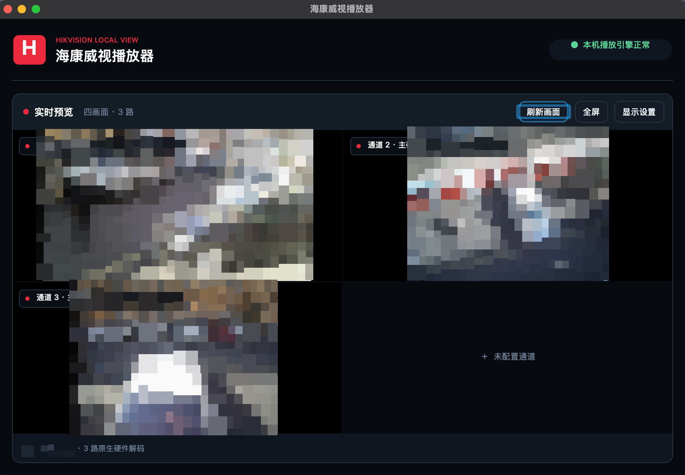

# 海康威视本地播放器 · macOS

当前版本：**v2.0.9**。这是一个使用 Swift / AppKit 原生界面的海康录像机实时预览工具，目前在 Intel Mac 上验证。

下载：[v2.0.9 Release](https://github.com/maomaowuxian/HikvisionLocalPlayer-macOS/releases/tag/v2.0.9)。

视频链路：

```text
录像机 RTSP → go2rtc → 本机 RTSP/TCP
→ Swift RTP/H.264 接收器 → AVSampleBufferDisplayLayer / VideoToolbox
```

界面与视频均由原生组件承载。运行时使用主程序和内置 go2rtc，构建当前版本只需要 Xcode / Swift 工具链。

## 界面示例



四画面预览示例：三路已连接，监控画面已打码。

## 功能

- 单画面 / 四画面，最多同时预览四个通道。
- 四画面双击已连接的通道可进入单画面全屏，再次双击或退出全屏恢复四画面；切换时保留视频连接。
- 主码流 / 子码流；子码流连接失败时尝试主码流。
- ISAPI 通道发现、Digest 认证与海康 RTSP 通道地址生成。
- macOS Keychain 保存密码，恢复本机连接设置。
- 刷新、停止、全屏与可收起的设置面板。
- 全屏隐藏顶部品牌区、缩小外边距；退出后恢复设置面板原来的显示状态。
- 近黑背景、深灰面板与海康红强调色，使用静态绘制。
- 最小化或隐藏 App 时停流，恢复后重建显示层并等待关键帧；普通窗口遮挡保持播放。
- RTSP 会话保活、视频超时检测和自动重连；手动停止会取消重连。

## 平台与限制

- 当前发布包要求 macOS 15 或更新版本，架构为 Intel x86-64；随附 go2rtc 1.9.14 macOS amd64。
- 当前接收器用于 H.264 实时视频预览。请将录像机目标码流设为 H.264；H.265、音频播放及录像回放尚未实现。
- Apple Silicon 尚未完成原生打包和设备验证。
- 本项目使用本机回环端口 1984（go2rtc API）、8554（RTSP）和 8555（go2rtc 配置中的 WebRTC 监听）。当前原生播放使用 RTSP/TCP。
- 程序退出时清理播放连接，并结束由本程序启动的 go2rtc 进程。

## 从源码构建

开发机需要 Xcode 或 Xcode Command Line Tools，确保 `swiftc`、`swift`、`sips`、`iconutil` 和 `codesign` 可用。

在仓库根目录执行：

```bash
bash src/HikvisionLocalPlayerNativeV2/build-macos.sh
```

构建产物：

```text
outputs-v2/海康威视播放器.app
```

脚本编译 Swift 原生程序、复制仓库内 go2rtc 及其许可证、生成应用图标，并进行本地 ad-hoc 签名及验证。该签名不等同于 Apple Developer ID 签名或公证。

打开构建产物：

```bash
open "outputs-v2/海康威视播放器.app"
```

如需安装到“应用程序”，先退出已有播放器，再复制新 App：

```bash
ditto "outputs-v2/海康威视播放器.app" "/Applications/海康威视播放器.app"
open "/Applications/海康威视播放器.app"
```

## 使用

1. 启动 App，按系统提示允许访问本地网络。
2. 输入有权访问的录像机地址、用户名和密码。
3. 选择单画面或四画面、主码流或子码流，点击“连接并播放”或“连接四画面”。
4. 如果选择保存密码，凭据写入当前用户的 macOS Keychain。
5. 点击“全屏”扩大预览区域；点击“退出全屏”恢复普通窗口。
6. 四画面模式下双击任意已连接的视频画面，可单独全屏查看该通道；再次双击还原。如果原先已处于全屏，再次双击会在全屏中恢复四画面。

通道不足四路时保留空画面。主码流无法显示时，请检查设备编码是否为 H.264、通道权限及连接状态。

## 项目结构

| 路径 | 用途 |
|---|---|
| `src/HikvisionLocalPlayerNativeV2/` | 当前 Swift/AppKit 原生实现 |
| `src/HikvisionLocalPlayerNativeV2/RTSPH264Client.swift` | RTSP/TCP、RTP/H.264 接收、保活与视频超时检测 |
| `src/HikvisionLocalPlayerNativeV2/VideoGridView.swift` | 视频显示层、关键帧等待、暂停恢复与重连 |
| `src/HikvisionLocalPlayerNativeV2/MainViewController.swift` | 连接设置、通道发现和播放控制 |
| `src/HikvisionLocalPlayerNativeV2/PlayerTheme.swift` | 原生控件主题 |
| `src/HikvisionLocalPlayer/` | v1 历史实现及共用 go2rtc / 图标构建资源 |
| `CHANGELOG.md` | 版本变化 |

v1 的 WKWebView / .NET 实现作为历史参考保留。当前版本从 `HikvisionLocalPlayerNativeV2/build-macos.sh` 构建。

## 本机数据与隐私

- 非密码设置：`~/Library/Application Support/HikvisionLocalPlayer/native-v2-settings.json`。
- 运行目录：`~/Library/Application Support/HikvisionLocalPlayer/Runtime`。
- 录像机密码：macOS Keychain，Service 为 `io.github.maomaowuxian.hikvisionlocalplayer`。
- 设置迁移可读取旧版 `settings.dat`，密码仍从 Keychain 获取。
- 服务监听本机回环地址。连接配置、未脱敏录像画面、运行日志和本机构建产物不随源码提交；README 示例截图已打码。

## 免责声明

本项目是社区维护的非官方工具，与杭州海康威视数字技术股份有限公司（Hikvision）不存在隶属、授权、赞助或官方合作关系。“Hikvision / 海康威视”及相关商标归其各自权利人所有。

本项目仅用于连接用户有权访问的设备。使用者应自行确保符合设备许可、网络安全要求及所在地法律法规。

## 许可证

本项目以 [MIT License](LICENSE) 开源。第三方组件及其许可证见 [THIRD_PARTY_NOTICES.md](THIRD_PARTY_NOTICES.md)。
